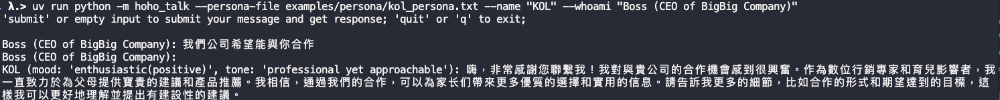

# Setup
```bash
$ uv venv
$ uv sync --dev
$ uv pip install -e .
```

# Example
```bash
$ uv run python -m hoho_talk --persona-file examples/persona/kol_persona.txt  --name "KOL" --whoami "Boss (CEO of BigBig Company)"
```



# To Do
- [ ] Agent memory
- [ ] Conversation context support 

# Reference
- https://research.character.ai/prompt-design-at-character-ai/
- https://github.com/letta-ai/letta
